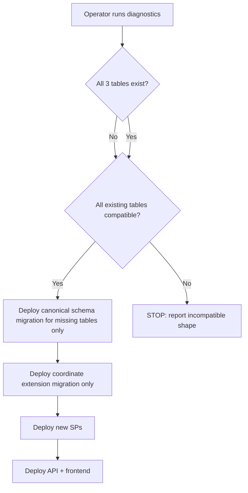

# Geo Address UI Integration Plan (Revised)

**Branch:** `feature/geo-address-ui-integration` (Phase A only)  
**Future branch:** `feature/geo-routing-smart-assignment` (Phase B only — not in this branch)  
**Historical reference only (do not execute):** [workplan_reports_overhaul_1c463576.plan.md](workplan_reports_overhaul_1c463576.plan.md)

**Explicit exclusions (unchanged):** Project Milestones, MilestoneId, milestone scoring, milestone-derived routing or assignment. Geographic destination resolves from task `SiteId` → validated Site address profile.

---

## Phase Overview

| Phase | Scope |
|-------|-------|
| **Phase 0** | Operator diagnostics + idempotent DB deployment gate (schema and/or coordinates) |
| **Phase A** | Validated employee/Site address UX, persistence, route invalidation, contextual display |
| **Phase B** | Geoapify Routing / Route Matrix, route estimate persistence, Smart Assignment travel-time population |

---

## 1. Phase 0 — Database Existence Gate

### 1.1 Problem statement

Repository schema files ([database/schema/tables.sql](database/schema/tables.sql)) define `Rec_EmployeeBaseAddress`, `Rec_SiteAddressProfile`, and `Rec_RouteEstimates`, but **deployed databases may not have these tables** (confirmed: [igroup30_prod.sql](igroup30_prod.sql) contains none of them). A coordinate-only migration is **insufficient** when tables are missing.

### 1.2 Operator read-only diagnostics (run first — do not execute in agent pass)

```sql
-- A. Table existence
SELECT t.name AS TableName
FROM sys.tables t
WHERE t.name IN (
  N'Rec_EmployeeBaseAddress',
  N'Rec_SiteAddressProfile',
  N'Rec_RouteEstimates'
)
ORDER BY t.name;

-- B. Column inventory per existing table (compare to expected schema below)
SELECT t.name AS TableName, c.name AS ColumnName, ty.name AS TypeName,
       c.max_length, c.precision, c.scale, c.is_nullable
FROM sys.tables t
JOIN sys.columns c ON c.object_id = t.object_id
JOIN sys.types ty ON c.user_type_id = ty.user_type_id
WHERE t.name IN (
  N'Rec_EmployeeBaseAddress',
  N'Rec_SiteAddressProfile',
  N'Rec_RouteEstimates'
)
ORDER BY t.name, c.column_id;

-- C. Constraint inventory
SELECT t.name AS TableName, k.name AS ConstraintName, k.type_desc
FROM sys.tables t
JOIN sys.key_constraints k ON k.parent_object_id = t.object_id
WHERE t.name IN (
  N'Rec_EmployeeBaseAddress',
  N'Rec_SiteAddressProfile',
  N'Rec_RouteEstimates'
)
UNION ALL
SELECT t.name, cc.name, N'CHECK'
FROM sys.tables t
JOIN sys.check_constraints cc ON cc.parent_object_id = t.object_id
WHERE t.name IN (
  N'Rec_EmployeeBaseAddress',
  N'Rec_SiteAddressProfile',
  N'Rec_RouteEstimates'
)
ORDER BY TableName, ConstraintName;

-- D. Index inventory (RouteEstimates only has non-PK/UQ index)
SELECT t.name AS TableName, i.name AS IndexName, i.is_unique
FROM sys.tables t
JOIN sys.indexes i ON i.object_id = t.object_id
WHERE t.name IN (
  N'Rec_EmployeeBaseAddress',
  N'Rec_SiteAddressProfile',
  N'Rec_RouteEstimates'
) AND i.name IS NOT NULL
ORDER BY t.name, i.name;

-- E. Operational data readiness
SELECT ValidationStatus, COUNT(*) AS Cnt
FROM dbo.Rec_EmployeeBaseAddress GROUP BY ValidationStatus;  -- skip if table missing

SELECT ValidationStatus, COUNT(*) AS Cnt
FROM dbo.Rec_SiteAddressProfile GROUP BY ValidationStatus;   -- skip if table missing

SELECT COUNT(*) AS CurrentRoutes
FROM dbo.Rec_RouteEstimates WHERE IsCurrent = 1;               -- skip if table missing
```

### 1.3 Expected canonical schema (source of truth: [database/schema/tables.sql](database/schema/tables.sql))

#### `Rec_EmployeeBaseAddress`

| Column | Type | Null | Notes |
|--------|------|------|-------|
| EmployeeBaseAddressId | int IDENTITY | NO | PK `PK_Rec_EmployeeBaseAddress` |
| EmployeeId | int | NO | UQ `UQ_Rec_EmployeeBaseAddress_EmployeeId`; FK → `Employees(EmployeeId)` |
| InputAddress | nvarchar(300) | NO | |
| FormattedAddress | nvarchar(300) | YES | |
| ValidationProvider | nvarchar(50) | YES | |
| ValidationStatus | nvarchar(30) | YES | |
| ValidationVerdict | nvarchar(50) | YES | |
| ValidationScore | decimal(5,2) | YES | CK 0–100 |
| ExternalPlaceRef | nvarchar(200) | YES | Geoapify `place_id` |
| Street | nvarchar(200) | YES | |
| HouseNumber | nvarchar(50) | YES | |
| City | nvarchar(100) | YES | |
| Postcode | nvarchar(30) | YES | |
| StateOrRegion | nvarchar(100) | YES | |
| Country | nvarchar(100) | YES | |
| ZoneId | int | YES | FK → `Rec_WorkZones(ZoneId)` |
| Latitude | decimal(9,6) | YES | **Added by coordinate migration (Phase 0 branch B)** |
| Longitude | decimal(9,6) | YES | **Added by coordinate migration (Phase 0 branch B)** |
| ValidatedAt | datetime2(0) | YES | |
| CreatedAt | datetime2(0) | NO | DEFAULT `sysutcdatetime()` |
| UpdatedAt | datetime2(0) | YES | |

No dedicated non-PK index beyond UQ on `EmployeeId`.

#### `Rec_SiteAddressProfile`

Same validation/address columns as employee profile, except:

| Difference | Value |
|------------|-------|
| PK | `SiteAddressProfileId` |
| Natural key | UQ `SiteId`; FK → `Sites(SiteId)` |
| InputAddress | **nullable** |
| Profile FK name | `FK_Rec_SiteAddressProfile_Sites`, `FK_Rec_SiteAddressProfile_WorkZones` |

Includes `Latitude`/`Longitude` decimal(9,6) NULL after coordinate migration.

#### `Rec_RouteEstimates`

| Column | Type | Null | Notes |
|--------|------|------|-------|
| RouteEstimateId | int IDENTITY | NO | PK |
| EmployeeId | int | NO | FK → `Employees` |
| TargetSiteId | int | NO | FK → `Sites` |
| OriginType | nvarchar(30) | NO | CK: `HomeBase`, `PlannedStop`, `LastKnownLocation` |
| OriginReferenceId | int | YES | |
| OriginAddress | nvarchar(300) | YES | |
| TargetAddress | nvarchar(300) | YES | |
| RoutingProvider | nvarchar(50) | YES | |
| RoutingStatus | nvarchar(30) | YES | |
| RoutingMode | nvarchar(20) | NO | CK: `Driving`, `Walking`, `Cycling`; DEFAULT `Driving` |
| EstimatedDistanceKm | decimal(10,2) | YES | CK ≥ 0 |
| EstimatedTravelMinutes | int | YES | CK ≥ 0 |
| CalculatedAt | datetime2(0) | NO | DEFAULT `sysutcdatetime()` |
| IsCurrent | bit | NO | DEFAULT 1 |

**Index:** `IX_Rec_RouteEstimates_EmployeeId_TargetSiteId_Current` on `(EmployeeId, TargetSiteId, IsCurrent)`.

### 1.4 Compatibility check rules

Before any migration or SP deploy:

1. If table **missing** → eligible for canonical schema creation (branch A).
2. If table **exists** → compare columns, PK, UQ, FK, CK, defaults, indexes to expected schema.
3. **Compatible** = same column names and types (nullable may differ only if additive nullable columns are planned), same FK targets, same UQ keys.
4. **Incompatible** = missing required column, type mismatch, wrong FK/UQ, extra columns that break SP contracts → **STOP and report**; do not drop, recreate, or overwrite.
5. **Never** `DROP TABLE`, `TRUNCATE`, or destructive alter on existing compatible tables.

Legacy seed value `ValidationStatus = 'Seeded'` is incompatible with Phase A constants — treat as legacy data to remap or re-validate in dev; not a schema blocker.

### 1.5 Branching deployment order



**Ordered steps:**

| Step | Condition | Action | Script |
|------|-----------|--------|--------|
| 0 | Always | Run diagnostics (Section 1.2) | Manual SQL |
| 1 | Any table missing | Idempotent **canonical schema migration** creates only missing tables with PK, FK, UQ, CK, defaults, indexes per Section 1.3 | `database/migrations/2026-06-20_geo_rec_tables_canonical.sql` (new) |
| 2 | All tables exist and compatible | Idempotent **coordinate extension** adds `Latitude`/`Longitude` to profile tables if absent | `database/migrations/2026-06-20_geo_address_coordinates.sql` (new) |
| 3 | After Step 1 or 2 confirmed | Deploy SPs (Section 10) — **never before table existence confirmed** | `database/SP/sp_*.sql` |
| 4 | After SPs | Deploy backend | `apps/api/` |
| 5 | After backend | Deploy frontend | `apps/web/` |

**Gate rule:** No SP referencing `Rec_*` geographic tables may be deployed until diagnostics confirm the referenced table exists with compatible shape.

---

## 2. Verified Current State (summary)

- Geo backend: `GET /api/Geo/autocomplete`, `GET /api/Geo/validate` — [GeoController.cs](apps/api/ManageR2.Api/Features/Geo/GeoController.cs), [GeoapifyClient.cs](apps/api/ManageR2.Infrastructure/Features/Geo/Clients/GeoapifyClient.cs)
- No frontend geo feature; no profile persistence; no route writer
- Smart Assignment reads `Rec_RouteEstimates` (result set 12); **GeographicScore uses travel minutes only**; missing route → **neutral 50**
- Employees: no address UI; Sites: free-text `AddressLine`/`City` in [ProjectOverviewTab](apps/web/src/features/projects/components/ProjectDrawer/components/ProjectOverviewTab/ProjectOverviewTab.tsx)
- Read SPs exist; write/upsert/invalidation SPs **missing**

---

## 3. Backward-Compatible Enforcement Rule (Phase A)

Phase A **must not**:

- Block task, project, or service-call creation because the selected Site lacks a validated address
- Block employee save because address is missing or unvalidated
- Require validated addresses for existing operational workflows

Phase A **must**:

- Keep existing employees and Sites fully usable
- Show a **visible warning** when validated geographic data is missing (employee base address or Site profile)
- Preserve Smart Assignment **neutral geographic score (50)** when no usable current route exists (verified behavior)
- Never treat raw free-text address as verified geographic data for routing or scoring

Making validated addresses **mandatory** is a separate future business decision — out of scope for Phase A.

---

## 4. Persisted Validation States

### 4.1 Allowed persisted values

**ValidationProvider** (persisted only when validation attempted or profile saved from validated result):

| Value | When persisted |
|-------|----------------|
| `Geoapify` | Successful validation or re-save of previously validated profile |
| `NULL` | `Typed` / `Stale` / `Invalid` rows with no provider confirmation |

**ValidationStatus** (persisted only — never write transient states):

| Value | Meaning |
|-------|---------|
| `Typed` | User-entered text saved without passing validation |
| `Validated` | Provider-confirmed; `ValidatedAt` set; coordinates and `ExternalPlaceRef` required |
| `Invalid` | Validation attempted; provider result unusable |
| `Stale` | Text changed after last successful validation; prior provider fields retained but status downgraded |

**Not persisted:** `PendingValidation`, `ProviderUnavailable` — these exist only in request/UI layer.

**ValidationVerdict** (persisted):

| Value | Meaning |
|-------|---------|
| `Valid` | Passed server-side validation rules |
| `Incomplete` | Missing city/street/house-number per rules |
| `NotFound` | No provider match |
| `NULL` | No validation attempt (`Typed`, `Stale`) |

### 4.2 State transition matrix

| Scenario | Persisted result | Prior valid profile |
|----------|------------------|---------------------|
| User changes text after validation (save without re-validating) | `Stale`; keep last provider fields for audit; clear `ValidatedAt` | Overwritten with Stale row |
| User selects suggestion + validate succeeds | `Validated`, `ValidationVerdict=Valid`, provider fields + coords + `ValidatedAt` | Replaced |
| Validation fails (incomplete/not found) | `Invalid`, appropriate verdict; **no** `ValidatedAt` | Unchanged if upsert rejected; if user explicitly saves invalid attempt, persist `Invalid` without clearing operational entity |
| Provider unavailable (HTTP/timeout/429) | **No profile write** | **Unchanged** — API returns error; UI shows provider-unavailable state |
| Previous valid profile exists + provider unavailable on re-validate | **No profile write** | **Retained** |
| User saves free text without validation | `Typed`, provider fields NULL, no `ValidatedAt` | Replaces prior row (may downgrade from Validated) |
| Backend receives `Validated` without provider proof | **Reject** upsert (400 ProblemDetails) | Unchanged |

**Rules:**

- Raw text alone is never stored as `Validated`
- `ValidatedAt` populated only on successful validation save
- Server rejects `ValidationStatus=Validated` without: `ValidationProvider=Geoapify`, non-empty `ExternalPlaceRef`, non-null coordinates (post Phase 0), score ≥ threshold, required structured fields

---

## 5. Selected Employee Save Behavior (non-atomic)

**Decision:** Employee core save and base-address profile save are **separate HTTP operations** — not one database transaction.

### Flow

1. User saves employee core fields → `POST /api/employees` or `PUT /api/employees/{id}` (existing endpoints, `[Authorize(Roles = "Admin")]`).
2. If address section has data → `PUT /api/employees/{id}/base-address` (new endpoint).
3. Address remains **optional** for backward compatibility.

### Partial-failure behavior

| Outcome | UI behavior |
|---------|-------------|
| Core save succeeds, address save succeeds | Full success toast |
| Core save succeeds, address save fails | **Partial success**: employee saved; InlineAlert "העובד נשמר, אך שמירת כתובת הבסיס נכשלה" + **Retry address only** button (re-calls PUT base-address without re-posting employee) |
| Core save fails | Error; no address call; nothing persisted |

**Never** claim the entire operation rolled back when core employee row was committed.

### Hydration

On drawer open: parallel `GET /api/employees/{id}` + `GET /api/employees/{id}/base-address` (404/null = no profile).

---

## 6. Selected Site Save Behavior (atomic composite)

**Decision:** Site operational fields + address profile + conditional route invalidation persist in **one database transaction** via a composite stored procedure. Existing Site endpoints remain unchanged for backward compatibility.

### New composite endpoints

| Method | Route | Auth | Behavior |
|--------|-------|------|----------|
| POST | `/api/sites/with-address-profile` | `CanManageProjects` | Creates Site + upserts profile atomically |
| PUT | `/api/sites/{id}/with-address-profile` | `CanManageProjects` | Updates Site + upserts profile + invalidates stale routes atomically |

**Preserved unchanged:** `GET/POST/PUT/DELETE /api/Sites` — existing consumers continue to work; ProjectOverviewTab **migrates to composite endpoints** for create/edit with validated address.

### Composite SP: `sp_Site_SaveWithAddressProfile`

Single transaction (explicit `BEGIN TRAN` / `COMMIT` / `ROLLBACK`):

1. `INSERT` or `UPDATE` `dbo.Sites` operational fields (`SiteName`, `AddressLine`, `City`, `IsPrimary`, `Notes`, `CustomerId`)
2. Upsert `dbo.Rec_SiteAddressProfile` via concurrency-safe pattern (Section 8)
3. If validated profile stable identity **genuinely changed** → `UPDATE Rec_RouteEstimates SET IsCurrent = 0 WHERE TargetSiteId = @SiteId AND IsCurrent = 1`
4. Return SiteId + profile snapshot

Operational `AddressLine`/`City` are synced from validated/normalized components on save (single user input via `ValidatedAddressField`).

### Partial-failure

Composite endpoint either **fully succeeds or fully rolls back** — no partial Site without profile when using composite endpoints. If composite fails, UI shows single error; user retries full site save.

Read-only profile fetch: `GET /api/sites/{id}/address-profile` (separate, read-only).

---

## 7. Verified Authorization Mechanism

Policies and roles verified in [AuthorizationPolicies.cs](apps/api/ManageR2.Api/Authorization/AuthorizationPolicies.cs) and controller usage:

| Endpoint | Authorization | Verified roles |
|----------|---------------|----------------|
| `GET /api/Geo/autocomplete`, `GET /api/Geo/validate` | `[Authorize]` (explicit) + fallback authenticated-user policy | Any authenticated user |
| `GET /api/employees/{id}/base-address` | `Policies.CanViewEmployees` | Admin, SeniorManagement |
| `PUT /api/employees/{id}/base-address` | `[Authorize(Roles = "Admin")]` | Admin only — matches [EmployeesController](apps/api/ManageR2.Api/Features/Employees/EmployeesController.cs) create/update |
| `GET /api/sites/{id}/address-profile` | `Policies.CanViewCustomers` | Admin, SeniorManagement, ProjectManager, Office — matches [SitesController](apps/api/ManageR2.Api/Features/Sites/SitesController.cs) class-level read |
| `POST/PUT /api/sites/with-address-profile` | `Policies.CanManageProjects` | Admin, SeniorManagement, ProjectManager — matches SitesController write |
| Existing `GET/POST/PUT/DELETE /api/Sites` | Unchanged | As today |

No new authorization policies required for Phase A.

---

## 8. Concurrency-Safe Upsert Design

**Do not use SQL Server `MERGE`.**

Required pattern inside explicit transaction:

```sql
BEGIN TRAN;

UPDATE dbo.Rec_EmployeeBaseAddress
SET ... , UpdatedAt = sysutcdatetime()
WHERE EmployeeId = @EmployeeId;

IF @@ROWCOUNT = 0
BEGIN
    INSERT INTO dbo.Rec_EmployeeBaseAddress (...)
    VALUES (...);
END

COMMIT TRAN;
```

Same pattern for `Rec_SiteAddressProfile` keyed by `SiteId`.

**Backstop:** unique constraints `UQ_Rec_EmployeeBaseAddress_EmployeeId` and `UQ_Rec_SiteAddressProfile_SiteId` — concurrent insert race caught and retried or surfaced as conflict.

Dedicated SPs:

- `sp_EmployeeBaseAddress_Upsert` — used by employee address PUT
- `sp_SiteAddressProfile_Upsert` — called from within `sp_Site_SaveWithAddressProfile` (not exposed separately to API for Site composite flow)

Server-side enforcement of validation rules inside upsert SP or service layer before SP call.

---

## 9. Geoapify Authentication and Logging Rules

**Do not assume header-based API key auth.** During implementation, verify the official Geoapify contract for the chosen endpoints (autocomplete, geocode/search, routing, route matrix) and use the documented authentication method.

**Required regardless of auth transport:**

| Rule | Requirement |
|------|-------------|
| API key location | Backend configuration / user-secrets only (`Geoapify:ApiKey`) |
| Frontend | Never in Vite env, `.env`, or API responses |
| Logging | Structured: operation name, duration ms, HTTP status — **never** log complete provider URL with key |
| Query redaction | If query-string auth is required by provider, redact `apiKey` parameter in any diagnostic log |
| Localization | `lang=he` where supported |
| Country filter | `filter=countrycode:il` (or equivalent) where supported |
| Errors | Map provider failures to API errors without leaking secrets |

Configuration command (placeholder only):

```powershell
dotnet user-secrets set "Geoapify:ApiKey" "PASTE_GEOAPIFY_KEY_HERE" --project apps/api/ManageR2.Api/ManageR2.Api.csproj
```

UserSecretsId: `manager2-api-development`.

### Geo backend hardening (Phase A)

- Min input length (3 chars) in service layer
- `CancellationToken` end-to-end
- HttpClient timeout ~15–20s
- Non-success HTTP handling (429 → 503; no unhandled 500 for provider errors)
- Api-layer DTOs (not Infrastructure models at HTTP boundary)
- Provider unavailability returns API error — **does not** touch persisted profiles

---

## 10. Updated SP List

| SP | Purpose | Deploy after |
|----|---------|--------------|
| `sp_EmployeeBaseAddress_GetByEmployeeId` | Read single profile | Phase 0 gate |
| `sp_EmployeeBaseAddress_Upsert` | Idempotent upsert (UPDATE/INSERT) | Phase 0 gate |
| `sp_SiteAddressProfile_GetBySiteId` | Read single profile (may wrap `Rec_GetSiteAddressProfile`) | Phase 0 gate |
| `sp_SiteAddressProfile_Upsert` | Idempotent upsert; called inside composite SP | Phase 0 gate |
| `sp_Site_SaveWithAddressProfile` | **Atomic** Site + profile + route invalidation | Phase 0 gate |
| `sp_RouteEstimates_InvalidateByEmployeeId` | Soft-invalidate `IsCurrent = 0` | Phase 0 gate |
| `sp_RouteEstimates_InvalidateByTargetSiteId` | Soft-invalidate by Site | Phase 0 gate |

**Existing read SPs (unchanged):** `Rec_GetAllCandidateBaseAddresses`, `Rec_GetSiteAddressProfile`, `Rec_GetCurrentRouteEstimatesForSite`, embedded sets in recommendation-input SPs.

**Route invalidation trigger (Phase A):**

- Employee address PUT: compare stable identity; if changed and new status is `Validated` → `sp_RouteEstimates_InvalidateByEmployeeId`
- Site composite save: invalidation inside same transaction when profile identity changed
- Unchanged address → **no** invalidation

**Stable comparison order:** (1) `ExternalPlaceRef`, (2) rounded coordinates, (3) normalized `FormattedAddress` + `City` + `Postcode`.

---

## 11. Phase A Scope

**In:** Phase 0 migrations, hardened Geo API, employee address GET/PUT, Site composite save, shared `features/geo` UI, Employee Drawer address section, ProjectOverviewTab migration to composite Site save + single address input, Project/ServiceCall validated address display (read-only + warning), route invalidation, tests.

**Out:** Geoapify Routing, route estimate writes, Smart Assignment changes, milestone changes, mandatory validation enforcement, Customer/Contact address validation.

---

## 12. Phase B — Routing vs Route Matrix Decision Point

**Not implemented on current branch.**

During Phase B implementation, evaluate **both** Geoapify options:

| API | Best when |
|-----|-----------|
| **Routing API** (pairwise origin→destination) | Few candidates (1–3), need failure isolation per employee, cache miss on subset |
| **Route Matrix API** (N origins × 1 destination) | Many assignable candidates share one Site target; batch cheaper/faster than N routing calls |

**Decision inputs at runtime:**

- Current candidate count for the task
- Provider rate limits and credit cost per call type
- Latency budget for recommendation request
- Cache hit rate (skip matrix rows already current)
- Failure isolation (matrix partial failure vs individual routing fallback)

**Recommended Phase B strategy (to confirm during implementation):**

1. Load assignable employees with validated base coordinates.
2. Resolve task Site validated coordinates.
3. Partition employees into cache-hit (reuse current `Rec_RouteEstimates`) vs cache-miss.
4. If cache-miss count = 1 → Routing API.
5. If cache-miss count ≥ 2 → Route Matrix API (origins = employees, destination = Site), with per-row fallback to Routing API on matrix partial failure.
6. Persist via concurrency-safe route upsert SP; preserve neutral 50 when route unavailable.

---

## 13. Shared Frontend Geo Feature

[`apps/web/src/features/geo/`](apps/web/src/features/geo/)

- `geoApiClient.ts` — backend only
- `ValidatedAddressField` — accessible combobox (not `ListSelect` — free-text + suggestions)
- Debounce 300ms, min length 3, `AbortController` stale-request cancellation
- States: loading, empty, invalid, validated, provider-unavailable (from API error), API error
- Text change clears client validation selection (maps to `Stale`/`Typed` on save)
- RTL, keyboard navigation, portal dropdown

### Employee Drawer integration

- Address section optional
- Partial-success UI with address-only retry
- Create: POST employee → PUT base-address (two steps, explicit UX)

### Site integration (ProjectOverviewTab)

- Replace dual `address`/`city` inputs with single `ValidatedAddressField`
- Create/edit call composite endpoints only
- Display validation badge

### Project / Service Call display

- Read `GET /api/sites/{id}/address-profile`
- Show site name, formatted address, validation indicator, warning if missing/unvalidated
- Action to edit Site — **does not block** task/service-call save

---

## 14. Updated Files List

### Database (new)

- `database/migrations/2026-06-20_geo_rec_tables_canonical.sql`
- `database/migrations/2026-06-20_geo_address_coordinates.sql`
- `database/SP/sp_EmployeeBaseAddress_GetByEmployeeId.sql`
- `database/SP/sp_EmployeeBaseAddress_Upsert.sql`
- `database/SP/sp_SiteAddressProfile_GetBySiteId.sql`
- `database/SP/sp_SiteAddressProfile_Upsert.sql`
- `database/SP/sp_Site_SaveWithAddressProfile.sql`
- `database/SP/sp_RouteEstimates_InvalidateByEmployeeId.sql`
- `database/SP/sp_RouteEstimates_InvalidateByTargetSiteId.sql`

### Backend (Phase A)

- `ManageR2.Domain/Features/Geo/AddressValidationConstants.cs`
- `ManageR2.Api/Features/Geo/` — DTOs, hardened controller
- `ManageR2.Api/Features/EmployeeAddresses/EmployeeAddressesController.cs`
- `ManageR2.Api/Features/Sites/SitesCompositeController.cs` (or extend SitesController with composite routes)
- `ManageR2.Infrastructure/Features/Geo/` — hardened client/service
- `ManageR2.Infrastructure/Features/AddressProfiles/` — repos, services
- `ManageR2.Api/Program.cs` — DI
- `ManageR2.UnitTests/Features/Geo/`, `Features/AddressProfiles/`

### Frontend (Phase A)

- `apps/web/src/features/geo/**`
- `apps/web/src/features/employees/components/EmployeeDrawer/EmployeeDrawer.tsx`
- `apps/web/src/features/projects/components/ProjectDrawer/components/ProjectOverviewTab/ProjectOverviewTab.tsx`
- `apps/web/src/features/projects/api/projectsApiClient.ts` — composite site calls
- `apps/web/src/features/serviceCalls/components/ServiceCallDrawer/ServiceCallDrawer.tsx`

### Phase B (future branch only)

- `GeoapifyRoutingClient`, route matrix client, `sp_RouteEstimates_UpsertCurrent`, routing service, Smart Assignment wiring tests

---

## 15. Updated Deployment Order

1. Operator diagnostics (Section 1.2)
2. Compatibility assessment (Section 1.4)
3. If incompatible → **STOP**
4. Canonical schema migration (missing tables only)
5. Coordinate extension migration (profile tables)
6. Deploy SPs (Section 10)
7. Deploy backend
8. Deploy frontend
9. Manual acceptance (Section 17)

---

## 16. Updated Test Plan

### Phase 0 / operator

- Diagnostics scripts produce expected shape report

### Phase A backend

- Geo: min length, success, no results, cancellation, timeout, provider failure, missing key, malformed JSON, no secret in logs/responses
- Validation state: reject fake `Validated`; persist `Typed`/`Invalid`/`Stale` correctly; provider failure does not overwrite valid profile
- Employee upsert: concurrency-safe pattern; invalidation on change; no invalidation when unchanged
- Site composite: atomic rollback on profile failure; operational + profile committed together; invalidation inside transaction
- Authorization: Admin-only employee address write; CanManageProjects composite site write

### Phase A frontend

- ValidatedAddressField: debounce, stale abort, keyboard, RTL, all states including provider-unavailable
- Employee partial success + address-only retry
- Site composite save (single transaction from UI perspective)
- Project/ServiceCall warning display without blocking save
- Missing validated data shows warning only

### Phase B (future)

- Routing vs matrix selection logic, cache reuse, stale rejection, concurrent upsert, SA travel minutes, neutral 50, no Euclidean scoring

---

## 17. Manual Acceptance Checklist

- [ ] Phase 0 diagnostics run; deployment branch selected correctly
- [ ] Geo autocomplete/validate work; API key not exposed to frontend or logs
- [ ] Employee: core save succeeds independently; address optional
- [ ] Employee: partial success shown when address save fails; retry works
- [ ] Employee: validated address persists and hydrates on reopen
- [ ] Site: composite create/update saves operational + profile atomically
- [ ] Site: single address input; no conflicting editable sources
- [ ] Project/ServiceCall: show validated Site address + warning when missing — **save not blocked**
- [ ] Route invalidation on genuine address change; no invalidation when unchanged
- [ ] Smart Assignment unchanged (neutral 50 without routes)
- [ ] Milestones untouched
- [ ] RTL + keyboard navigation in address combobox

---

## 18. Recommended Implementation Order

1. Phase 0 migration scripts (review; operator deploys)
2. SPs with upsert + composite Site SP
3. Harden Geo backend + DTOs + tests
4. Address profile repos/services/controllers + tests
5. Frontend `features/geo` + component tests
6. Employee Drawer (non-atomic save + partial-success UX)
7. ProjectOverviewTab → composite Site endpoints + ValidatedAddressField
8. Project/ServiceCall read-only display
9. Employee route invalidation wiring
10. Build/test/lint + manual acceptance

**Phase B begins only after Phase A merge on `feature/geo-routing-smart-assignment`.**

---

## Implementation Todos

- [ ] **phase0-diagnostics** — Document operator SQL; define compatibility checker criteria
- [ ] **phase0-migrations** — Author canonical schema + coordinate extension migrations (idempotent)
- [ ] **sps** — Create get/upsert/invalidation SPs + atomic `sp_Site_SaveWithAddressProfile`
- [ ] **harden-geo** — Geoapify client/service/controller per Section 9
- [ ] **backend-profiles** — Repos, services, controllers, validation constants, tests
- [ ] **frontend-geo** — `features/geo`, ValidatedAddressField, hooks, tests
- [ ] **integrate-employee** — Non-atomic save + partial-success + retry UX
- [ ] **integrate-site** — Composite endpoints + ProjectOverviewTab migration
- [ ] **display-contexts** — Project/ServiceCall warnings (non-blocking)
- [ ] **acceptance** — Manual checklist + build/test/lint
