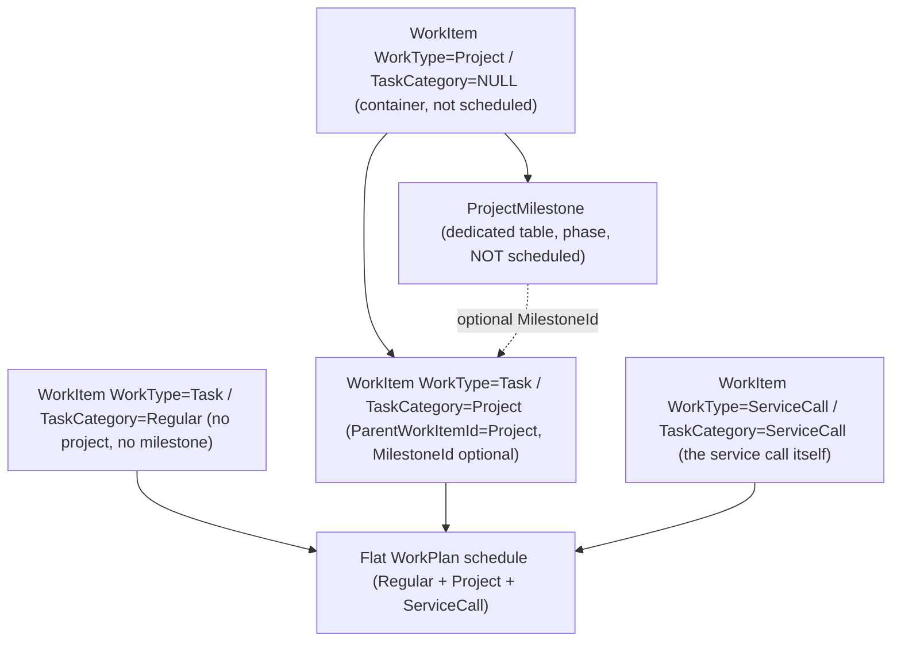
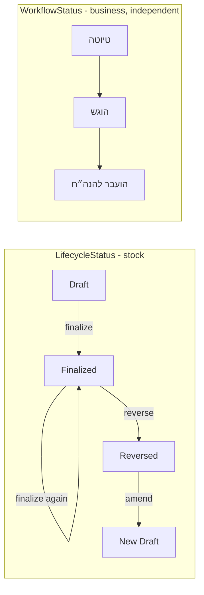

# WorkPlan, Task, Milestone, Smart-Assignment & Work-Report Overhaul (Final Revision 3)

Grounded in the **current** repository and the live production dump `igroup30_prod.sql` (script date 19/06/2026 14:44 — current, not legacy). Preserves all previously approved decisions and applies three remaining blocking corrections.

## 0. Final-round corrections highlighted (this revision)

1. **Cross-report stock concurrency protection** — finalize/reverse lock both the report row and every affected `InventoryItems` row (guarded atomic decrement in deterministic id order) so two different reports cannot over-consume the same item. See §13.3.
2. **Aggregated stock validation by InventoryItemId** — required quantity is summed per `InventoryItemId` across lines/usage types before validation/decrement. See §13.3.
3. **Legacy DATETIME2 timezone diagnostics + migration boundary** — existing planned times are naive Israel-local (proven from the write/read path); a guarded, diagnostics-gated `AT TIME ZONE` migration converts them to UTC, or stops-and-reports. See §6.2 and §8.3.
4. **New-data UTC serialization rules** — API accepts ISO with offset/Z, normalizes to UTC, stores/returns UTC; frontend converts to local. See §6.2.
5. **LifecycleStatus vs WorkflowStatus** — a new `LifecycleStatus` (Draft/Finalized/Reversed) drives stock/editability; the existing Hebrew `Status` is preserved as the business `WorkflowStatus`. See §8.2 and §13.1.
6. **Legacy report-status preservation** — `LifecycleStatus` is backfilled from `Status` while the original business `Status` is kept active; unknown values stop-and-report. See §8.2.

---

## 1. Current-state findings (verified)

- **One polymorphic table.** Projects, tasks, milestones, service calls are all `dbo.WorkItems` rows discriminated by free-text `WorkType` (`'Project'`/`'Task'`/`'ServiceCall'`). No `TaskCategory`, `ProjectId`, `MilestoneId`, `ServiceCallId`, `IsArchived`. Hierarchy via `ParentWorkItemId`.
- **No WorkItems service layer.** `[WorkItemsController](apps/api/ManageR2.Api/Features/WorkItems/WorkItemsController.cs)` → `[WorkItemRepository](apps/api/ManageR2.Infrastructure/Features/WorkItems/Repositories/WorkItemRepository.cs)` → SPs (no inline SQL).
- **Service call IS the WorkItem.** `WorkType='ServiceCall'`, `ParentWorkItemId=NULL`, `CustomerId`+`SiteId` on the row; `[ServiceCallsController](apps/api/ManageR2.Api/Features/ServiceCalls/ServiceCallsController.cs)` exposes `POST /api/ServiceCalls` and `POST /api/ServiceCalls/{id}/assign-employee`. Reports link by `WorkItemId` + `ReportType='service_call'`.
- **WorkPlan contract is project-centric** (`Project → Tasks → Assignments`); regular/internal tasks only render under the synthetic INTERNAL container; service calls (`ParentWorkItemId=NULL`) never appear.
- **Synthetic internal project:** `[sp_WorkItems_GetInternalContext](database/SP/sp_WorkItems_GetInternalContext.sql)` get-or-creates an `Internal` customer (`CustomerType='Internal'`), default site, and hidden container (`WorkType='Project'`, `FinanceProjectNumber='INTERNAL'`).
- **Milestones == project tasks in storage** (`WorkType='Task'`, `ParentWorkItemId=projectId`); no dedicated table.
- **Planned datetimes are naive local wall-clock today (PROVEN).** `[NewTaskModal](apps/web/src/features/workplan/components/NewTaskModal/NewTaskModal.tsx)` builds `plannedStart/plannedEnd` as `` `${date}T${time}:00` `` (no offset, no `Z`); the API binds to `DateTime?` and the SP persists it verbatim into `datetime2`; `[workPlanScheduling.ts](apps/web/src/features/workplan/lib/workPlanScheduling.ts)` reads via a date-prefix regex and `new Date(value)`/`.getHours()` with an explicit "no timezone reinterpretation" comment. So existing `PlannedStart/PlannedEnd` are stored as **Israel local wall-clock, not UTC** — production values must still be confirmed by diagnostics before any conversion (§8.3).
- **WorkItems nullability:** `CustomerId NOT NULL`, `SiteId NULL`, `ParentWorkItemId NULL`, planning fields nullable. No `IsArchived` (only `Status`, `ClosedAt`, `IsLocked`).
- **Smart assignment supports drafts.** `POST /SmartAssignment/recommend-draft` scores an unsaved task (synthesized in SQL, no insert) but **requires `projectId > 0`**. Scoring lives in `[SmartAssignmentService](apps/api/ManageR2.Infrastructure/Features/SmartAssignment/Services/SmartAssignmentService.cs)`; frontend only calls APIs.
- **Work reports** = `WorkReports` + `WorkReportEmployeeAssignments` + `WorkReportSystems`; denormalized; single `WorkItemId` FK; times `nvarchar(10)`; **no inventory lines, attachments, or duration**; transactional create/update. **`WorkReports.Status` current values (business workflow):** `'טיוטה'` (draft), `'הוגש'` (submitted), `'הועבר להנה״ח'` (transferred to accounting; in `[statusRegistry.ts](apps/web/src/shared/status/statusRegistry.ts)`). Status consumers: `sp_CreateWorkReport`/`sp_WorkReports_Update`/`sp_WorkReports_GetList`/`sp_WorkReports_GetById`, `[WorkReportRepository](apps/api/ManageR2.Infrastructure/Features/Reports/Repositories/WorkReportRepository.cs)`, report DTOs/models, `[ReportsPage](apps/web/src/features/reports/pages/ReportsPage/ReportsPage.tsx)` (`LIST_STATUS_OPTIONS=['הוגש','טיוטה']`, submit/draft mutations), `StatusBadge` + `statusRegistry`. `WorkReports` has `CreatedAt` but **no `UpdatedAt`**.
- **Inventory** = single `InventoryItems` table; `SkuCode` filtered-unique index (active only); 8 canonical categories; single `QuantityOnHand` (CHECK `>= 0`). **No stock-movement ledger, no exact-SKU lookup.**
- **Upload reference pattern:** Project Drawings (private `App_Data`, authenticated `PhysicalFile`, GUID names, MIME/size validation, path-traversal guard, orphan cleanup).
- **No tests**; `eslint` + `tsc -b && vite build`. Migrations `YYYY-MM-DD_snake_case.sql`, idempotent, ordered `sqlcmd` per `[RUNBOOK.md](database/RUNBOOK.md)`.
- **Shared API client** `[apiRequest](apps/web/src/api/client.ts)` supports `FormData` + `apiBlobRequest`; structured `ApiError`. React Query `staleTime 30s`, `retry 1`.

## 2. Schema drift (dump vs migrations vs code)

- `igroup30_prod.sql` is authoritative (42 tables, 134 SPs); `[tables.sql](database/schema/tables.sql)` is a stale 31-May baseline; new objects ship via the `2026-06-19` migration + canonical `SP/` files. Pre-existing SP gaps to fix where intersected: `[sp_GetWorkItemDetails](database/SP/sp_GetWorkItemDetails.sql)` omits `ParentWorkItemId`; `[sp_GetWorkItems](database/SP/sp_GetWorkItems.sql)`/`[sp_GetTasksByParentWorkItemId](database/SP/sp_GetTasksByParentWorkItemId.sql)` omit planning fields.

## 3. Root causes

- **Synthetic internal project:** forced by `CustomerId NOT NULL` + a project-centric WorkPlan.
- **Milestones schedulable:** same `WorkType='Task'` + `ParentWorkItemId` shape; no discriminator.
- **Regular/service-call tasks** cannot be represented without a project wrapper.

---

## 4. Final domain model + WorkType/TaskCategory matrix

**Matrix:** Project container = `Project`/`NULL` (not schedulable); Regular = `Task`/`Regular` (no parent/milestone, optional customer/site); Project task = `Task`/`Project` (parent=Project, optional milestone of that project); Service call = `ServiceCall`/`ServiceCall` (no milestone); legacy archived milestone rows = `IsArchived=1` (exempt from the CHECK; never scheduled).

**Enforcement:** backend + frontend constants, **server derives WorkType from TaskCategory**, service-layer validation, SP validation (`THROW`), DB CHECK `CK_WorkItems_TypeCategory` (added `WITH NOCHECK`, enabled `WITH CHECK` after migration), migration verification for invalid combinations.

## 5. Final ServiceCall creation model + unified draft-recommendation flow

A service call is the WorkItem itself — no separate parent record, no `ServiceCallSelector`, no `ServiceCallId`, no `ParentWorkItemId` overload. **One consistent New Task flow for Regular, Project, and ServiceCall:** (1) complete unsaved form; (2) optional manual employee; (3) optional `POST /SmartAssignment/recommend-draft` on unsaved data (no row created); (4) recommendation never overwrites manual selection; (5) only `בחר עובד מומלץ` changes it; (6) save only after the employee decision; (7) ServiceCall save creates exactly one ServiceCall WorkItem via `POST /api/ServiceCalls` (server sets `WorkType='ServiceCall'` + `TaskCategory='ServiceCall'`); (8) then assign the chosen employee (`POST /ServiceCalls/{id}/assign-employee`; Regular/Project use `POST /WorkItems/{id}/assign-employee`); (9) no temporary/hidden row to obtain a recommendation; (10) no automatic post-create re-run to populate the employee.

## 6. Flat WorkPlan API contract

### 6.1 Response shape — scheduled vs unscheduled

`WorkPlanScheduleDto { ScheduledTasks: List<WorkPlanScheduledTaskDto>, UnscheduledTasks: List<WorkPlanScheduledTaskDto>, Employees: List<WorkPlanEmployeeDto> }`. `WorkPlanScheduledTaskDto`: `WorkItemId`, `Title`, `Description`, `TaskCategory`, `WorkType`, `Status`, `Priority`, `PlannedStart` (UTC), `PlannedEnd` (UTC), `DerivedDurationMinutes`, `EstimatedHours` (derived), `Assignments` (each with `AssignmentSource`), `IsLocked`, optional `CustomerId/CustomerName/SiteId/SiteName/ProjectId/ProjectTitle/MilestoneId/MilestoneTitle`, `IsServiceCall`. No fallback/synthetic dates — missing/invalid planned times → `UnscheduledTasks`.

### 6.2 Endpoint, overlap, and timezone

- `GET /api/WorkItems/work-plan?scope={company|personal|employee|project}&projectId=&employeeId=&status=&taskCategory=&fromUtc=&toUtc=&includeUnscheduled=true` → `WorkPlanScheduleDto`.
- **Scope:** Company = Regular+Project+ServiceCall; Personal = current employee's tasks; Employee = selected employee's tasks; Project = only `Project`-category tasks for `projectId`. No milestones, no archived rows.
- **Interval overlap (UTC):** `PlannedStart < @ToUtc AND PlannedEnd > @FromUtc` (never start-only). Scheduled requires both planned values valid.
- **Unscheduled:** `PlannedStart`/`PlannedEnd` null/invalid; same scope/projectId/employeeId/status/taskCategory filters; controlled by `includeUnscheduled` (default true); dedicated UI area; never an artificial hour/date.
- **Timezone (new-data policy):** API range params (`fromUtc`/`toUtc`) and all returned planned datetimes are **UTC (ISO 8601 with `Z`)**. The API accepts inbound ISO timestamps with an explicit offset or `Z`, normalizes to UTC, and persists UTC `datetime2`. The frontend converts the visible local day/week/month range to UTC before querying and converts UTC results back to local (Israel) for display. **Multi-day tasks** appear in every overlapping local day via per-day clamping (rendering only; no data duplication). Existing rows are made UTC by the §8.3 migration before this contract goes live.

### 6.3 Assignment inheritance decision

Personal/Employee scheduling uses **direct task assignments only** (`WorkEmployeeAssignments` by the task's `WorkItemId`); project-level assignments are **not** silently inherited. Each assignment carries `AssignmentSource = Task | Project`; default returns only `Task`. An optional transition fallback may return `Project`-source rows explicitly flagged (never merged silently), documented for removal once tasks carry direct assignments.

### 6.4 SP

`sp_GetWorkPlanSchedule(@Scope,@ProjectId,@EmployeeId,@Status,@TaskCategory,@FromUtc,@ToUtc,@IncludeUnscheduled,@CurrentUserEmployeeId)`: RS1 scheduled (overlap predicate on UTC; LEFT JOIN project/`ProjectMilestones`/`Customers`/`Sites`; `IsArchived=0`; INTERNAL + milestones never appear); RS2 unscheduled (when `@IncludeUnscheduled=1`); RS3 assignments + `AssignmentSource`; RS4 employee lookup. Repository `GetWorkPlanScheduleAsync` assembles the DTO.

## 7. WorkPlan frontend contract migration

File-by-file (from `MappedWorkPlan[]`/`project.tasks` to the flat schedule with UTC↔local conversion): `[WorkPlanDto.cs](apps/api/ManageR2.Api/Features/WorkItems/DTOs/WorkPlanDto.cs)`, `[WorkItemsController.cs](apps/api/ManageR2.Api/Features/WorkItems/WorkItemsController.cs)` (add `GET /work-plan`; reduce `{projectId}/work-plan` to a wrapper), `[IWorkItemRepository.cs](apps/api/ManageR2.Infrastructure/Features/WorkItems/Repositories/IWorkItemRepository.cs)`/`[WorkItemRepository.cs](apps/api/ManageR2.Infrastructure/Features/WorkItems/Repositories/WorkItemRepository.cs)` (`GetWorkPlanScheduleAsync`), `[workplan/types.ts](apps/web/src/features/workplan/types.ts)`, `[workPlanMappers.ts](apps/web/src/features/workplan/lib/workPlanMappers.ts)` (`mapWorkPlanSchedule`), `[useWorkPlanData.ts](apps/web/src/features/workplan/hooks/useWorkPlanData.ts)` (`useWorkPlanSchedule(filters)`, UTC range), `[workplanApiClient.ts](apps/web/src/features/workplan/api/workplanApiClient.ts)`, `[workPlanScheduling.ts](apps/web/src/features/workplan/lib/workPlanScheduling.ts)` (UTC→local, group/clamp multi-day per local day, unscheduled area, **remove all index/hardcoded/fallback placement**), `[WorkPlanPage.tsx](apps/web/src/features/workplan/pages/WorkPlanPage/WorkPlanPage.tsx)`, the four views, `[WorkPlanToolbar.tsx](apps/web/src/features/workplan/components/WorkPlanToolbar/WorkPlanToolbar.tsx)` (task-type filter), `[WorkPlanTaskPanel](apps/web/src/features/workplan/components/WorkPlanTaskPanel/index.ts)`. Temporary `buildLegacyMappedWorkPlans(scheduledTasks)` adapter removed at the end of the phase; the `{projectId}/work-plan` wrapper removed after that.

## 8. Database schema migration `2026-06-19_workplan_reports_overhaul.sql`

Guarded, idempotent, additive; no existing migration modified.

### 8.1 WorkItems + new tables

- `WorkItems`: add `TaskCategory NVARCHAR(20) NULL`, `MilestoneId INT NULL`, `IsArchived BIT NOT NULL DEFAULT 0`, `ArchivedAt DATETIME2 NULL`; make `CustomerId` nullable; `FK_WorkItems_Milestone`; `CK_WorkItems_TypeCategory` + `CK_WorkItems_RegularNoProject` (`WITH NOCHECK`); indexes `IX_WorkItems_TaskCategory/MilestoneId/IsArchived`; backfill unambiguous categories (INTERNAL-container children deferred to §9).
- New `ProjectMilestones` (PK, `ProjectId` FK→WorkItems, `Title`, `Description`, `SortOrder`, `Status`, `PlannedStart/End`, `ActualStart/End`, `ProgressPercent`, `IsActive`, `CreatedAt/UpdatedAt`, `LegacyWorkItemId`; index `IX_ProjectMilestones_Project_Sort`).
- New `WorkReportInventoryItems` (PK, `WorkReportId` FK, `InventoryItemId` FK, `Quantity DECIMAL(18,3) CHECK >0`, `UsageType CHECK IN ('Sold','Installed','Used')`, `SkuSnapshot`, `ItemNameSnapshot`, `CreatedAt`, `CreatedByUserId`; unique `(WorkReportId, InventoryItemId, UsageType)`).
- New `WorkReportAttachments` (PK, `WorkReportId` FK, `MediaType`, `OriginalFileName`, `StoredFileName`, `FilePath`, `ContentType`, `FileSizeBytes`, `UploadedAt`, `UploadedByUserId`).
- New `InventoryStockMovements` (PK, `InventoryItemId` FK, `WorkReportInventoryItemId INT NULL` FK, `QuantityDelta DECIMAL(18,3)` signed, `MovementType` (`ReportUsage`/`ReportReversal`), `SourceType NULL`, `SourceId NULL`, `UsageType NULL`, `CreatedAt`, `CreatedByUserId`; **`UX_InventoryStockMovements_Line_Type` UNIQUE on `(WorkReportInventoryItemId, MovementType)` WHERE `WorkReportInventoryItemId IS NOT NULL`** — idempotency backstop; index `(SourceType, SourceId)`).

### 8.2 WorkReports: LifecycleStatus vs WorkflowStatus (Correction 3, Option A — least disruptive)

- **Keep `WorkReports.Status`** as the business **WorkflowStatus** (Hebrew: `'טיוטה'`/`'הוגש'`/`'הועבר להנה״ח'`). All existing Status consumers (SPs, repo, DTOs, badges, filters) continue working unchanged.
- **Add `LifecycleStatus NVARCHAR(20) NOT NULL DEFAULT 'Draft'`** (`Draft`/`Finalized`/`Reversed`) — the stock/editability state machine, **independent** of WorkflowStatus.
- Add lifecycle columns: `FinalizedAt DATETIME2 NULL`, `FinalizedByUserId INT NULL`, `ReversedAt DATETIME2 NULL`, `ReversedByUserId INT NULL`, `ReversalReason NVARCHAR(500) NULL`, `AmendsWorkReportId INT NULL`, `UpdatedAt DATETIME2 NULL`, `UpdatedByUserId INT NULL`. FKs: `Finalized/Reversed/UpdatedByUserId`→`Users`, `AmendsWorkReportId`→`WorkReports` (self). Indexes `IX_WorkReports_LifecycleStatus`, `IX_WorkReports_AmendsWorkReportId`, `IX_WorkReports_WorkItemId`.
- **No `LegacyStatus` column** — the original business state is retained in `Status` itself (not relegated to a legacy field).
- **LifecycleStatus backfill (deterministic):** `'טיוטה'→'Draft'`; `'הוגש'→'Finalized'`; `'הועבר להנה״ח'→'Finalized'`. A guard lists any **other** distinct `Status` value and the migration **stops-and-reports** (does not enable the CHECK) until explicitly mapped. Legacy `Finalized` rows have **no** inventory lines (feature is new) → **no stock movements** backfilled.
- `CK_WorkReports_LifecycleStatus CHECK (LifecycleStatus IN ('Draft','Finalized','Reversed'))` added `WITH NOCHECK`, enabled `WITH CHECK` after backfill + guard pass. `Status` stays free-text (unconstrained) to avoid breaking existing workflow values.

### 8.3 Legacy planned-datetime UTC migration (Correction 2)

Delivered as a **separate, diagnostics-gated** script `database/migrations/2026-06-19_planned_datetime_utc.sql`:

- **Pre-flight diagnostics (required before applying):** confirm the current convention by inspecting the write path (`${date}T${time}:00` naive local — already shown), API `DateTime` binding, SP `datetime2` params, and representative production rows + seeds. Do **not** assume UTC.
- **If confirmed Israel local wall-clock:** add shadow columns `PlannedStartUtc`/`PlannedEndUtc DATETIME2 NULL`; populate via `CAST(PlannedStart AS DATETIME2) AT TIME ZONE 'Israel Standard Time' AT TIME ZONE 'UTC'` (the Windows tz id handles IST/IDT DST rules automatically; spring-forward gaps and fall-back overlaps resolve per SQL Server deterministic rules). Verify with the §16 scenarios, then swap (`PlannedStart = PlannedStartUtc`, drop shadow) in a guarded step. Apply the same conversion to `ActualStart/ActualEnd` and `ProjectMilestones` planned/actual dates created from legacy data.
- **If the convention cannot be determined safely:** the script **stops and reports** the ambiguous rows — it never auto-shifts task times.
- This migration runs **before** the flat WorkPlan UTC contract (§6.2) goes live, so all rows are UTC when the new endpoint/filters and frontend conversion ship.

## 9. Legacy-data migration `2026-06-19_legacy_data_migration.sql`

### 9.1 Phase A — Diagnostics (read-only)
Candidate milestone report (no title/heuristic/route classification) + internal-context report incl. a reference scan of Internal customer/site usage across all relevant tables.

### 9.2 Internal-context migration safety
Do not auto-archive the Internal customer/site (reference-scan first; leave active if referenced elsewhere). Per task under the confirmed INTERNAL container: `ParentWorkItemId=NULL`; `TaskCategory='Regular'`; clear `CustomerId`/`SiteId` only if they exactly equal the confirmed synthetic ids (else preserve real ones); preserve `WorkItemId`, assignments, reports, recommendations, dates, status, audit. Archive only the container project via `IsArchived` after verification. Then enable `CK_WorkItems_TypeCategory WITH CHECK`.

### 9.3 Explicit archive mechanism
`IsArchived` + `ArchivedAt` on `WorkItems` (`Status='Cancelled'` is never the archive mechanism); excluded from all project lists, WorkPlan SPs, selectors, lifecycle queries. Legacy archived milestone WorkItem rows remain for traceability but never schedule.

### 9.4 Milestone migration execution boundary (operator-gated)
`dbo._MilestoneMigrationMap(WorkItemId, ProjectId)`: empty → diagnostics only; no title/heuristic/route classification; only mapped ids copied to `ProjectMilestones` (`LegacyWorkItemId`) then archived; unsafe mapped rows **stop and report**; milestone assignments preserved in `dbo._MilestoneAssignmentAudit` (not auto-activated). **Agent Mode must not execute the milestone apply phase unless `_MilestoneMigrationMap` is explicitly populated and approved.**

### 9.5 Verification + rollback
Pre/post verification (internal-task counts, orphan checks, milestone parity, assignment preservation, zero invalid `(WorkType,TaskCategory)`, zero non-canonical `LifecycleStatus`, datetime-conversion spot checks); reverse scripts wrapped in `XACT_ABORT` transactions.

## 10. Stored procedures to add / change

- **Tasks:** `[sp_CreateWorkItem](database/SP/sp_CreateWorkItem.sql)`/`[sp_UpdateWorkItem](database/SP/sp_UpdateWorkItem.sql)` accept `@TaskCategory`/`@MilestoneId`/nullable customer-site; derive `WorkType`; validate matrix + milestone-belongs-to-project; compute derived `EstimatedHours`; reject end ≤ start; persist UTC. Fix `[sp_GetWorkItemDetails](database/SP/sp_GetWorkItemDetails.sql)`.
- **Flat WorkPlan:** new `sp_GetWorkPlanSchedule` (§6.4); update `[sp_GetProjectsList](database/SP/sp_GetProjectsList.sql)`/`[sp_GetAllProjectsForWorkPlans](database/SP/sp_GetAllProjectsForWorkPlans.sql)` to exclude `IsArchived=1` + INTERNAL and emit `TaskCategory`.
- **Service call:** `[sp_GetWorkItemsByType](database/SP/sp_GetWorkItemsByType.sql)` + the ServiceCalls create path set/emit `TaskCategory='ServiceCall'`.
- **Milestones:** new `sp_ProjectMilestones_*`; rewrite `[sp_GetProjectMilestones](database/SP/sp_GetProjectMilestones.sql)` + the milestone result set in `[sp_GetProjectLifecycle](database/SP/sp_GetProjectLifecycle.sql)`.
- **Smart assignment:** extend `Rec_GetDraftTaskRecommendationInput` (`@TaskCategory` + nullable `@ProjectId`).
- **Reports:** `sp_WorkReports_Finalize`, `sp_WorkReports_Reverse` (§13.3), `sp_WorkReportInventory_Add/Delete/GetByReport` (Add/Delete rejected unless `LifecycleStatus='Draft'`), `sp_WorkReportAttachments_Add/Delete/GetByReport`, `sp_InventoryStockMovements_ApplyForReport`, `sp_Inventory_GetBySku`. Update `[sp_CreateWorkReport](database/SP/sp_CreateWorkReport.sql)`/`[sp_WorkReports_Update](database/SP/sp_WorkReports_Update.sql)`/`[sp_WorkReports_GetById](database/SP/sp_WorkReports_GetById.sql)` for nullable context, report duration, `LifecycleStatus`, preserved `Status`, and `UpdatedAt/By`.
- `[sp_WorkItems_DeleteTask](database/SP/sp_WorkItems_DeleteTask.sql)`: account for `MilestoneId`/category; `[sp_WorkItems_GetInternalContext](database/SP/sp_WorkItems_GetInternalContext.sql)` deprecated post-migration.

## 11. Backend changes

- **WorkItems:** add `TaskCategory`/`MilestoneId`/`IsArchived`/`ArchivedAt` to `[WorkItem](apps/api/ManageR2.Domain/Features/WorkItems/Entities/WorkItem.cs)`; constants; `IWorkItemTaskService` (matrix, WorkType derivation, milestone + duration, UTC normalization). `[WorkItemRequestsDto](apps/api/ManageR2.Api/Features/WorkItems/DTOs/WorkItemRequestsDto.cs)` carries `TaskCategory`/optional parent-customer-site/`MilestoneId`; drop authoritative client `EstimatedHours`.
- **Service-call creation:** ServiceCalls create path sets `TaskCategory='ServiceCall'`; New Task ServiceCall calls it directly then assigns (§5).
- **Milestones:** `ProjectMilestone` entity/repo/controller + DTOs; remove milestone-as-WorkItem create/update from `[WorkItemsController](apps/api/ManageR2.Api/Features/WorkItems/WorkItemsController.cs)`; adapt `[ProjectLifecycleRepository](apps/api/ManageR2.Infrastructure/Features/Projects/Repositories/ProjectLifecycleRepository.cs)` + result/DTO.
- **Duration:** pure `DurationCalculator` (UTC); `EstimatedHours` derived.
- **Smart assignment:** `DraftTaskRecommendationRequestDto` carries `TaskCategory` + optional `ProjectId/SiteId/CustomerId`.
- **Flat WorkPlan API:** endpoint + repository + DTOs (§6).
- **Reports:** `WorkReportInventoryLine` + `WorkReportAttachment` models/DTOs + `LifecycleStatus`/`Status` (workflow) DTO fields + lifecycle columns; staged endpoints on `[ReportsController](apps/api/ManageR2.Api/Features/Reports/ReportsController.cs)`: `POST /Reports` (draft), `GET /Reports/{id}`, `PUT /Reports/{id}` (textual + Draft-only inventory; workflow `Status` editable independently), `POST /Reports/{id}/finalize`, `POST /Reports/{id}/reverse`, `POST /Reports/{id}/amend`, attachment upload/delete/stream, `GET /Inventory/by-sku/{sku}`. Attachment storage mirrors Project Drawings.
- **DI** in `[Program.cs](apps/api/ManageR2.Api/Program.cs)`; reuse existing policies.

## 12. Smart-assignment UX & API

Single recommendation block inside employee assignment; extended draft scoring (category-aware, project-optional, UTC times) on unsaved data for all three categories; manual selection never overwritten; only `בחר עובד מומלץ` populates the selector; recommendation stale on change of type/project/service-call/site/role/times; no hidden/orphan WorkItem; no frontend algorithm.

## 13. Report lifecycle (Corrections 2 and 3)

### 13.1 LifecycleStatus vs WorkflowStatus

- **LifecycleStatus** (`Draft`/`Finalized`/`Reversed`) controls **inventory editability and stock movement** only. Transitions: `Draft→Finalized` (apply stock once); `Finalized→Reversed` (compensating); `Reversed` is terminal (cannot finalize again); a correction after reversal creates a **new Draft** linked via `AmendsWorkReportId`.
- **WorkflowStatus** = the existing `Status` (`'טיוטה'`/`'הוגש'`/`'הועבר להנה״ח'`), unchanged. **Finalizing does not erase WorkflowStatus**, and **moving to accounting (a WorkflowStatus change) never applies stock a second time** — the two state machines are independent.

### 13.2 Editability rules (governed by LifecycleStatus)

- Inventory lines: editable **only** when `LifecycleStatus='Draft'`; immutable once Finalized; blocked at SP/service/UI.
- Attachments: editable while `Draft`; add/remove allowed while `Finalized` (no stock impact); read-only once `Reversed`.
- Textual fields: editable while `Draft`/`Finalized` (tracked via `UpdatedAt/By`); read-only once `Reversed`.
- WorkflowStatus may change at any non-`Reversed` lifecycle state without stock effect.

### 13.3 Cross-report, aggregated, concurrency-safe finalize/reverse (Corrections 1 and 3)

**Finalize** (`sp_WorkReports_Finalize`, `SET XACT_ABORT ON; BEGIN TRAN`):

1. Lock the report row: `SELECT @Life = LifecycleStatus FROM dbo.WorkReports WITH (UPDLOCK, HOLDLOCK) WHERE WorkReportId=@id;`.
2. If `Draft`:
   - **Aggregate required quantity per item:** `SELECT InventoryItemId, SUM(Quantity) AS Req FROM dbo.WorkReportInventoryItems WHERE WorkReportId=@id GROUP BY InventoryItemId ORDER BY InventoryItemId;` (the same item across multiple lines/usage types is summed once).
   - **Guarded atomic decrement in ascending `InventoryItemId` order** (deterministic to avoid deadlocks): for each, `UPDATE dbo.InventoryItems SET QuantityOnHand = QuantityOnHand - @Req WHERE InventoryItemId=@id AND QuantityOnHand >= @Req;` then `IF @@ROWCOUNT <> 1 THROW` (insufficient stock → `XACT_ABORT` rolls back everything). The `UPDATE` validates and deducts atomically and holds an exclusive lock on each `InventoryItems` row until commit, so a second report consuming the same item blocks, then re-reads the reduced/locked stock — preventing cross-report over-consumption and negative stock.
   - Insert one `ReportUsage` movement per `WorkReportInventoryItemId` (`QuantityDelta = -Quantity`); the unique index blocks duplicates.
   - Set `LifecycleStatus='Finalized'`, `FinalizedAt/By`. `Status` (workflow) is untouched.
3. If `Finalized`: return existing state, no movements. If `Reversed`: `THROW`. `COMMIT`.

> Documented equivalent alternative (same guarantees): explicitly `SELECT ... WITH (UPDLOCK, HOLDLOCK)` each `InventoryItems` row in ascending id order, validate the aggregate against the locked `QuantityOnHand`, then `UPDATE`. The guarded atomic `UPDATE` is chosen for simplicity.

**Reverse** (`sp_WorkReports_Reverse`): lock the report row; if `Finalized`, **lock and restore** each affected `InventoryItems` row in ascending id order (`UPDATE ... SET QuantityOnHand = QuantityOnHand + @Req WHERE InventoryItemId=@id`), insert one `ReportReversal` movement per line (unique index prevents double-restore), set `LifecycleStatus='Reversed'`, `ReversedAt/By/Reason`; if `Reversed`, return existing; if `Draft`, reject.

**Idempotency + concurrency guarantees:** repeated requests short-circuit on the locked LifecycleStatus check and the unique movement index; concurrent requests on the **same report** serialize on the report-row `UPDLOCK/HOLDLOCK`; concurrent finalizes of **different reports** consuming the **same item** serialize on the guarded `InventoryItems` `UPDATE` (exclusive row lock + `>= @Req` predicate), guaranteeing no negative stock, no partial movements, and no partially finalized report; the `QuantityOnHand >= 0` table CHECK is the final backstop.

## 14. SKU-scanning & attachment security

Exact SKU: `sp_Inventory_GetBySku` (active filtered index) + repository + `GET /Inventory/by-sku/{sku}` + DTO + client; hardware keyboard-wedge (Enter → exact lookup, whitespace/suffix normalization) + optional camera `BarcodeDetector` with graceful fallback + manual search; repeated scan increments quantity; unknown SKU shows a clear error. Attachments: private `App_Data` + authorized streaming endpoint, MIME+extension allow-list (images + video), configurable size limit, GUID stored filenames, original filename metadata, path-traversal protection, cleanup on DB failure; no base64 in SQL; no public folder for report media.

## 15. Cache invalidation plan

- Task create/update/assign: `['workplan','schedule', filters]` (+ `['workplan']`), `['projects']`, `['projectLifecycle',projectId]`, `['projectMilestones',projectId]`.
- Service-call task create: also `['serviceCalls']`.
- Milestone changes: `['projectMilestones',projectId]`, `['projectLifecycle',projectId]`.
- Report create/update/finalize/reverse/amend/workflow-change: `['reports']`, `['reports','detail',reportId]`; finalize/reverse also `['inventoryItems', filters]`.
- Inventory line/attachment changes: `['reports','detail',reportId]` (+ `['inventoryItems', ...]` on finalize/reverse). All via `invalidateQueries`; no full-page reload.

## 16. Testing & acceptance

- **`ManageR2.UnitTests` (xUnit, no DB):** duration (midnight crossing, end≤start, formatting); matrix/category invariants + WorkType derivation; **stock aggregation per item + idempotency + reversal math**; **interval-overlap predicate**; **UTC↔Israel-local conversion** (incl. IST/IDT).
- **SP smoke + concurrency scripts** (`sqlcmd`, multi-session): create regular/project/service-call task; milestone excluded; reject cross-project milestone; exact-SKU; **finalize then re-finalize → identical stock, no extra movement**; **two parallel finalizes of the SAME report → one movement set**; **two DIFFERENT Draft reports consuming the SAME InventoryItem with combined qty > stock, finalized in parallel → exactly one succeeds (or neither over-consumes), no negative stock, no partial movements, no partial finalize**; **reverse → single restoration, locks items**; **edit finalized inventory line → rejected**; **LifecycleStatus backfill** maps all legacy `Status` values and stops on unknowns; **finalize leaves WorkflowStatus unchanged**; **to-accounting workflow change applies no stock**.
- **Timezone verification:** an existing row before vs after migration; a row in Israel **standard** time; a row in Israel **daylight-saving** time; a task crossing midnight; a multi-day task; UTC range overlap correctness after conversion.
- **Validation commands:** `dotnet build` + `dotnet test`; `npm run lint` + `npm run build`; DB pre/post diagnostics + §9.5; `git diff --check` (format only).
- **Manual acceptance** (originals + new): unified draft-first flow; one ServiceCall row; flat scheduled/unscheduled split with no fake project/date; multi-day overlap; direct task assignments; archive exclusion; matrix CHECK; internal-context safety; milestone apply gate; **cross-report stock safety**; **lifecycle vs workflow independence** (finalize keeps `הוגש`; accounting move applies no stock); **legacy status preserved**; timezone scenarios. Separate newly introduced failures from pre-existing ones.

## 17. Risks & backward-compatibility

- **Cross-report stock contention** — mitigated by the report-row lock + guarded atomic per-item decrement in deterministic id order; deadlocks minimized by ascending-id ordering; unique movement index + `QuantityOnHand>=0` CHECK as backstops.
- **Legacy datetime conversion** — highest-risk data change; gated by diagnostics, applied via shadow columns + `AT TIME ZONE` (DST-aware) with verification before swap; stops-and-reports if the convention is unproven; must ship before the UTC WorkPlan contract.
- **LifecycleStatus vs WorkflowStatus** — two coexisting fields add surface area; Option A keeps all existing `Status` consumers working; finalize/workflow are independent; documented clearly to avoid conflation.
- **CustomerId nullable**, **flat WorkPlan contract**, **milestone extraction**, **internal customer/site never auto-archived**, **assignment inheritance default = direct** — as previously documented (adapters/wrappers, `LegacyWorkItemId`, reference checks, `AssignmentSource`).
- `tables.sql` stays stale-by-design; new objects ship via `2026-06-19` migrations; `RUNBOOK.md` gains the new ordered steps (overhaul → planned-datetime-utc → legacy-data). Mocks updated for compilation only.

## 18. Exact files expected to change / add

- **DB add:** `database/migrations/2026-06-19_workplan_reports_overhaul.sql`, `database/migrations/2026-06-19_planned_datetime_utc.sql`, `database/migrations/2026-06-19_legacy_data_migration.sql`; new `database/SP/`: `sp_GetWorkPlanSchedule.sql`, `sp_ProjectMilestones_*.sql`, `sp_WorkReports_Finalize.sql`, `sp_WorkReports_Reverse.sql`, `sp_WorkReportInventory_*.sql`, `sp_WorkReportAttachments_*.sql`, `sp_InventoryStockMovements_ApplyForReport.sql`, `sp_Inventory_GetBySku.sql`, `Rec_GetDraftTaskRecommendationInput.sql` (canonical); `database/RUNBOOK.md` (+ optionally `database/schema/tables.sql`).
- **DB change:** `sp_CreateWorkItem`, `sp_UpdateWorkItem`, `sp_GetWorkItemDetails`, `sp_GetWorkItemsByType`, `sp_GetProjectsList`, `sp_GetAllProjectsForWorkPlans`, `sp_GetProjectMilestones`, `sp_GetProjectLifecycle`, `sp_CreateWorkReport`, `sp_WorkReports_Update`, `sp_WorkReports_GetById`, `sp_WorkReports_GetList`, `sp_WorkItems_DeleteTask`, `sp_WorkItems_GetInternalContext` (deprecate).
- **Backend add:** `ProjectMilestone` entity/repo/controller + DTOs, `IWorkItemTaskService`, `DurationCalculator`, `WorkPlanScheduleDto`/`WorkPlanScheduledTaskDto`/`WorkPlanEmployeeDto`, report inventory/attachment/stock + lifecycle DTOs, `WorkItemWorkTypes`/`WorkItemTaskCategories` constants, `ManageR2.UnitTests`.
- **Backend change:** `WorkItem.cs`, `WorkItemsController.cs`, `WorkItemRequestsDto.cs`, `WorkPlanDto.cs`, `WorkItemRepository.cs`/`IWorkItemRepository.cs`, `ServiceCallsController.cs` + ServiceCall DTO/validator, `ProjectsController.cs`, `ProjectLifecycleRepository.cs`, `ProjectMilestoneResult.cs`/`ProjectMilestoneDto.cs`, `SmartAssignmentController.cs` + DTO + `SmartAssignmentService.cs` + repo, `ReportsController.cs` + DTOs + `WorkReportRepository.cs` + models, `InventoryController.cs` + `InventoryItemRepository.cs` + DTO, `Program.cs`.
- **Frontend add:** `taskCategories.ts`, `inventoryUsageTypes.ts`, `reportLifecycle.ts`, UTC↔local datetime helpers, `MilestoneSelector`, milestones API client, report inventory-lines + SKU-scan + attachments components, flat WorkPlan schedule types/mapper. (No `ServiceCallSelector`.)
- **Frontend change:** `NewTaskModal`, `EditTaskDrawer`, `WorkPlanPage`, `WorkPlanToolbar`, `WorkPlanDailyGrid`/`Weekly`/`Monthly`/`Yearly`, `WorkPlanTaskPanel`, `workPlanScheduling.ts`, `workPlanMappers.ts`, `useWorkPlanData.ts`, `useWorkPlanPageState.ts`, `workplanApiClient.ts`, `workplan/types.ts`, `workplan/constants.ts`, `ProjectMilestonesTab`, `projectsApiClient.ts`, `useProjectLifecycle.ts`, `projects/types.ts`, `serviceCalls/api` + `useServiceCalls` (reused by New Task), `ReportsPage`, `ReportDetailModal`, `reportsApiClient.ts`, `useReports.ts`, `reports/types.ts`, `statusRegistry.ts` (keep `report` workflow domain + add `reportLifecycle` domain), `inventoryApiClient.ts`, `inventory/types.ts`, `shared/mock/index.ts`.

---

The phases (frontmatter to-dos) are ordered by dependency: the planned-datetime UTC migration ships before the flat WorkPlan contract; the milestone apply phase is hard-gated on an approved `_MilestoneMigrationMap` (diagnostics only until then).
